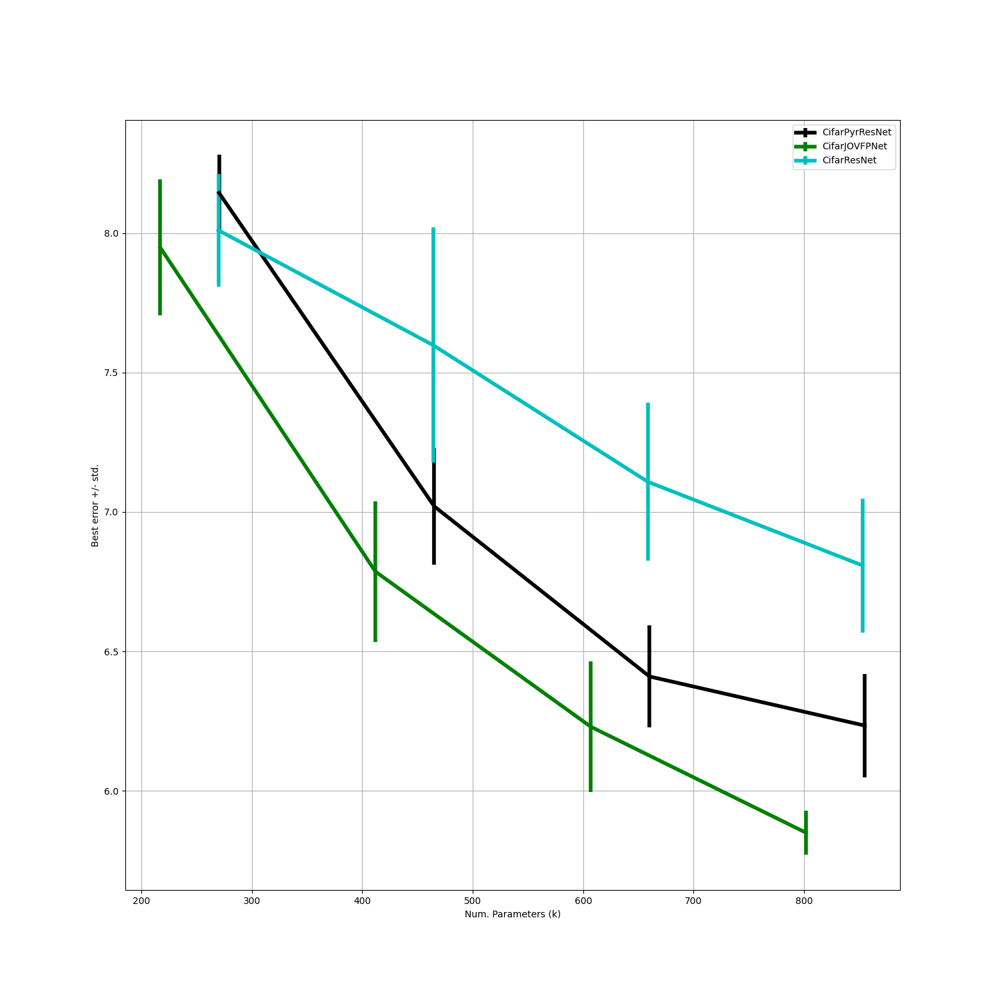

# Experiment 0: Computing Cifar-10 baselines and old results

### Abstract

Can we reproduce the ResNet's Cifar-10 results. And compare it to a network with PyramidBlocks and our current best FP-net.

### Introduction

For first JOV-paper submission, a small mistake was made when creating the network architectures. Instead of changing the number of feature maps always in the first block of a stack, it was changed in the last block. This is no big deal, however, it complicates the direct comparison with the standard Cifar-10 resnet. Thus, we first reproduce the JOV Cifar experiment with the altered architecture. Furthermore, we make sure that the ResNet results match the He et al. paper results.


### Methods

* Train on Cifar-10 with the data augmentation described in He et al.'s [Deep Residual learning](https://arxiv.org/pdf/1512.03385.pdf)
* Report the mean ± std. best accuracy and test error over all epochs.
* Do this for 5 runs with 5 different seeds.
* Use the following architecture: 
    1.) starting conv 3x3 3->16, BN, ReLU,
    2.) 3 stacks with 16->16, 16->32, 32->64 fmap changes alway in the first block. 
    3.) Number of blocks of each stack is N=3, 5, 7, 9
* Compare three different architectures:
    1.) Original ResNet with the ResNet basic block
    2.) Pyramid ResNet, using the Pyramid basic block
    3.) FP-net, each stack's first block is changed to an FP-block as in JOV

### Hypothesis
* The outcome of the original ResNet should resemble the ones in this [link](https://github.com/akamaster/pytorch_resnet_cifar10)
*The models N=3 and N=5 were better in our case (see eval-file), but the results were still plausible. For N=7 and N=9, the results did match.*

* The Pyramid results should be worse than the ones reported in the JOV-paper. However, still better than the original ResNet
*Especially for the first models (N=3, N=5), the results detriorated. Here, the effect of fewer feature maps should be the strongest, i.e., the relative change of the parameter number is much larger here. Furthermore, we do not know the initialization effect. The result is better than the ResNet, as expected.*
* The FP-net results should be worse than the ones reported in the JOV-paper. However, still better than the PyramidNet.
*For N=9, the difference is quite small between the original experiment and this experiment. The Network is still better than the other nets, but now there is a overlap of the standard deviations for N=3, N=5, N=7.*

If any of the three outcomes do no eventuate, there may be a bug somewhere.


### Name at least four possible bugs. Did you check them before running?

* Is the mean ± std. best accuracy and test error over all epochs really what He et al. reference in the paper?

*From [training very deep networks](https://arxiv.org/pdf/1507.06228.pdf):
"To provide a better estimate of the variability of classification results due to random initialization, we report our results in the format Best (mean±std.dev.)based on 5 runs wherever available"*

*However, it seems that He et al. used early stopping on a validation set.*
*From the Ydelbayev Repo:
"Our implementation follows the paper in straightforward manner with some caveats: First, the training in the paper uses 45k/5k train/validation split on the train data, and selects the best performing model based on the performance on the validation set. We do not perform validation testing; if you need to compare your results on ResNet head-to-head to the orginal paper keep this in mind."
Ydelbayvev seems to save the best model on the test set.*

* The models/blocks that were trained do not conform with the models described here

*In the test cases, each block was tested to produce the same result as in the original repositories. The right initialization was applied to the ResNet and PyramidNet.*
*Each model was once check using Tensorboard on 24.03.2021.*

* The output of the train printer (last epoch) does not match an evaluation for each datapoint.

*We used early stopping here. But the accuracy of the loaded model on the Cifar-10 validation dataset object matches the maximum val-accuracy in the log-file.*

* The mean values computed by pandas are not right.
*Did one calculation by hand. It works.*

### Hyperparameters

From the original paper:
"
We adopt batchnormalization  (BN)  [16]  right  after  each  convolution  and before activation, following [16].
"
*This rule is applied in the basic block and in the first conv-layer of the architectures.*

"
On this dataset we use identity shortcuts in all cases (i.e., option A) [...].

We use a weight decay of 0.0001 and momentum of 0.9, and adopt the weight initialization in [13] and BN [16] but with  no  dropout. These  models  are  trained  with  a  mini-batch size of 128 on two GPUs.  We start with a learning rate of 0.1,  divide it by 10 at 32k and 48k iterations,  and terminate training at 64k iterations, which is determined on a 45k/5k train/val split. We follow the simple data augmentation in [24] for training: 4 pixels are padded on each side,and  a  32×32  crop  is  randomly  sampled  from  the  padded image or its horizontal flip.  For testing, we only evaluate the single view of the original 32×32 image
"
*It is not explicitly said, but it can be assumed that SGD is used (used on all other experiments).*

*Cifar-10: 50k train images: 64k iterations -> (64k x 128)/50k = 164 Epochs.*

*(32k x 128)/50k = 82 Epochs.*

*(48k x 128)/50k = 123 Epochs.*

*Although this is different from the original paper, we will take the epoch numbers from Ydelbayev: 200 Epochs and a change after 100 and 150 epochs.*

About the initialization:
"
... This leads to a zero-mean Gaussian distribution whose standard deviation (std) is `$$\frac{\sqrt(2)}{n_l}$$`. This is our way of initialization.
"
*n_l is the number of channels times kernel_size squared of a layer l*.
"
He initialization works better for layers with ReLu activation.
"

Pytorch default initialization:
```

    def reset_parameters(self):
        n = self.in_channels
        for k in self.kernel_size:
            n *= k
        stdv = 1. / math.sqrt(n)
        self.weight.data.uniform_(-stdv, stdv)
        if self.bias is not None:
            self.bias.data.uniform_(-stdv, stdv)

```

Here is a gain value [list](https://pytorch.org/docs/stable/nn.init.html). It is sqrt(2) for ReLUs. This value is multiplied by either fan-in or fan-out. The number of input or output layers multiplied by the kernel size (**?not sure for fan-out?**).

What initialization is used for the [pyramid nets](https://arxiv.org/pdf/1610.02915.pdf)?

"
The filter parameters are initialized by “msra” 
"

From the original [code](https://github.com/dyhan0920/PyramidNet-PyTorch/blob/master/PyramidNet.py):
```
for m in self.modules():
    if isinstance(m, nn.Conv2d):
        n = m.kernel_size[0] * m.kernel_size[1] * m.out_channels
        m.weight.data.normal_(0, math.sqrt(2. / n))
    elif isinstance(m, nn.BatchNorm2d):
        m.weight.data.fill_(1)
        m.bias.data.zero_()
```

*The weird thing is: they use fan-out weighting instead of fan-in.*

*We will keep the uniform init for the FP-net for now. **Also for the PyramidBlock**. However, it would be interesting to see if there are differences between Gauss and Uniform and fan_in and fan_out*


### What happened?

The result were as expected. However, the smaller number of feature maps had a detriorating effect on smaller models. For N=3, N=5 and, N=7, there was an overlap of the standard deviations. However, not for N=9. Here, the new number of feature maps did not change the result by much. 
Here is the Plot:


