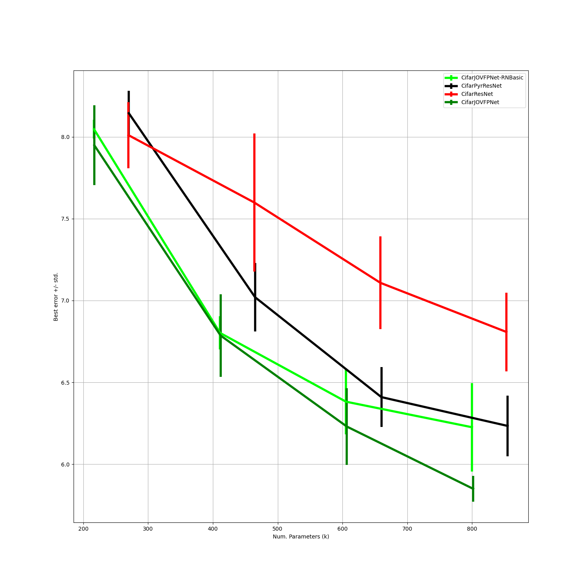

# Experiment 4: Test different AbsReLU & FP derivations

## Abstract

This is a composition of several smaller questions.
1.) How big is the impact of the PyramidBlock for an FPJOV-Net?

## Introduction?

1.) Experiment 0 shows that FP-blocks with Pyramidblocks are a very good combination on Cifar-10. However, can FP-blocks also improve a standard ResNet.

## Methods

We use the same experiment scheme as in Exp1. However, only with 3 runs per model.
We train ?? models:
1.) ```CifarJOVFPNet-RNBasic```, where the ```default_block``` is a ```BasicBlock```.
2.) ```CifarAbsReLU-LS-realAbs```,where the ```ReLUBabylon``` nn.module is exchanged with an ```Abs``` nn.module.
3.) ```CifarAbsReLU-LS-NoNorm```, the block architecture is similar to AbsReLU-block, but no instance normalization is used. The `CifarJOVFPNet-NoNorm` as well to check the influence of normalization when multiplication is used.


## Hypothesis?

1.) Worse than the original FP-Net with Pyramid blocks. The basic block structure usually performs worse
2.) No difference, but maybe faster
3.) Worse than the original and for the `CifarJOVFPNet-NoNorm` even worse. 


## Hyperparameters (experiments appendix)
Same as in exp0.

## Results

### 1.) Impact of the PyramidBlock
Here is the plot for 1.) 


While the `CifarJOVFPNet-RNBasic` is worse than the FPNet with PyramidBlocks it performs better than the baseline `CifarPyrResnet`and the `CifarResNet`. Therefore the FPBlocks seem to improve performance on the standard Resnet and also be competitive to the `CifarPyrResnet`.


